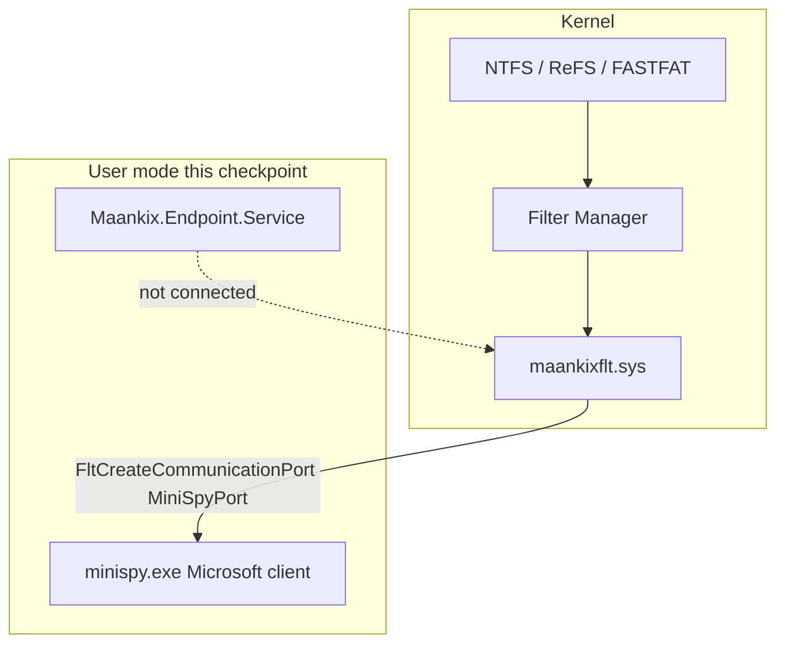
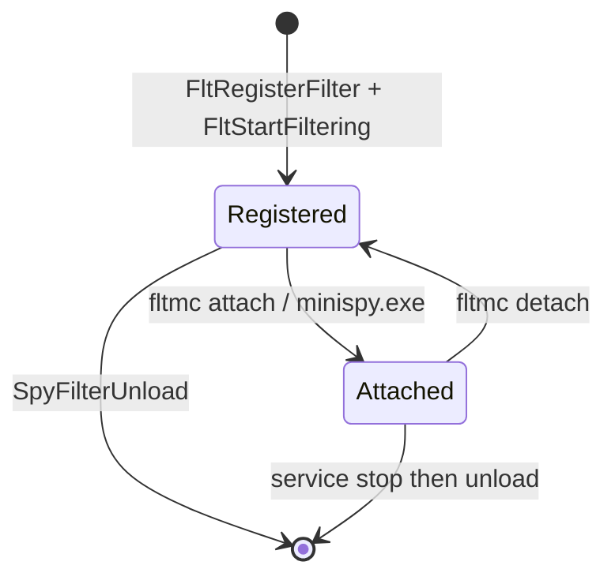

# maankixflt — MiniSpy foundation

Status: compile / load / unload / understand  
Code: `src/Maankix.Endpoint.Driver/`  
Upstream: Microsoft MiniSpy (`197ba2156a60e2b76fcd4820bae594223e91a1e9`)

This document explains the vendored driver. It does not change it. File ownership is listed in [`src/Maankix.Endpoint.Driver/ORIGIN.md`](../src/Maankix.Endpoint.Driver/ORIGIN.md).

## Folder structure

```
src/Maankix.Endpoint.Driver/
├── maankixflt.sln              WDK solution (not Maankix.sln)
├── maankixflt.inf              Install / SCM / instance altitudes
├── Directory.Build.props       Isolates WDK from .NET props
├── filter/                     Kernel minifilter → maankixflt.sys
│   ├── minispy.c               DriverEntry, port, pre/post, unload
│   ├── RegistrationData.c      FLT_REGISTRATION
│   ├── mspyLib.c               Record allocator / logger
│   ├── mspyKern.h
│   └── maankixflt.vcxproj
├── inc/minispy.h               Shared with user mode
└── user/                       Microsoft MiniSpy console → minispy.exe
```

`Maankix.sln` stays .NET-only so `dotnet build` does not attempt WDK toolsets.

## Architecture



The service still exposes an empty `IFilterCommunicationPort`. Nothing in .NET opens `\MiniSpyPort`.

```
I/O request
    → I/O Manager
    → Filter Manager
    → SpyPreOperationCallback      log, usually SUCCESS_WITH_CALLBACK
    → file system
    → SpyPostOperationCallback     complete the log record, queue it
    → (optional) minispy.exe pulls records via the port
```

MiniSpy never fails an I/O. Pre-operation returns `FLT_PREOP_SUCCESS_WITH_CALLBACK` or `FLT_PREOP_SUCCESS_NO_CALLBACK`. There is no deny path.

## DriverEntry

`filter/minispy.c` — `DriverEntry`

1. Zero / init `MiniSpyData` (sequence, lookaside, spinlock, output list).
2. Dynamically resolve Vista transaction APIs (`FltGetRoutineAddress`).
3. `SpyReadDriverParameters` from the service registry key.
4. `FltRegisterFilter(DriverObject, &FilterRegistration, &MiniSpyData.Filter)`.
5. `FltBuildDefaultSecurityDescriptor` + `FltCreateCommunicationPort` on `MINISPY_PORT_NAME` (`\MiniSpyPort`) with `SpyConnect` / `SpyDisconnect` / `SpyMessage`, max 1 client.
6. `FltStartFiltering`.

On failure the `finally` block closes the port, unregisters the filter, and deletes the lookaside.

## Filter registration

`filter/RegistrationData.c` — `FilterRegistration`

| Field | Value |
| --- | --- |
| Operation callbacks | `Callbacks[]` — almost every IRP_MJ_* plus Fast I/O and mount/dismount |
| FilterUnload | `SpyFilterUnload` |
| InstanceSetup | `NULL` (Filter Manager default: attach when asked) |
| InstanceQueryTeardown | `SpyQueryTeardown` (always `STATUS_SUCCESS`, allows manual detach) |
| Instance teardown start/complete | `NULL` |
| KTM (Vista+) | `SpyKtmNotificationCallback` |

`Callbacks[]` pairs `SpyPreOperationCallback` / `SpyPostOperationCallback` for each major function except `IRP_MJ_SHUTDOWN` (post is not supported; pre completes the record inline).

## Communication port

Port name is still `\MiniSpyPort` (`inc/minispy.h`). Changing it would break `minispy.exe`.

| Callback | When |
| --- | --- |
| `SpyConnect` | User mode connects; stores `ClientPort` (one connection) |
| `SpyDisconnect` | `FltCloseClientPort` |
| `SpyMessage` | `GetMiniSpyLog` or `GetMiniSpyVersion` |

Buffers are raw user addresses. MiniSpy probes via try/except as documented in the Microsoft comments in `SpyMessage`. The Maankix service does not call this port.

## Pre-operation callbacks

`SpyPreOperationCallback` in `minispy.c`:

- Runs on the paging path (non-paged).
- Allocates a log record (`SpyNewRecord`). If the lookaside is exhausted, it skips logging and does **not** fail the I/O.
- Queries a normalized name (`FltGetFileNameInformation`).
- `SpyLogPreOperationData`.
- Returns `FLT_PREOP_SUCCESS_WITH_CALLBACK` and passes the record as completion context.
- For `IRP_MJ_SHUTDOWN`, calls the post routine directly.

## Post-operation callbacks

`SpyPostOperationCallback`:

- May run at DPC (non-paged).
- If `FLTFL_POST_OPERATION_DRAINING`, frees the record and returns.
- `SpyLogPostOperationData`, optional reparse-tag record, `SpyLog` onto the user-mode queue.
- On successful transactional create, `SpyEnlistInTransaction`.
- Always `FLT_POSTOP_FINISHED_PROCESSING`.

## Instance lifecycle

INF instances (Microsoft names and altitudes, flags `0x1` = no automatic attachment):

| Instance | Altitude | Meaning |
| --- | --- | --- |
| Minispy - Top Instance | 385100 | Default instance |
| Minispy - Middle Instance | 370000 | Manual attach only |
| Minispy - Bottom Instance | 361000 | Manual attach only |

Load registers the filter with FltMgr. Attach is a separate step (`fltmc attach` or `minispy.exe`). Unload is refused while instances remain unless the OS is stopping the service; `SpyQueryTeardown` allows detach.



## Driver unload

`SpyFilterUnload`:

1. `FltCloseCommunicationPort` — no new clients.
2. `FltUnregisterFilter`.
3. `SpyEmptyOutputBufferList`.
4. `ExDeleteNPagedLookasideList`.
5. `STATUS_SUCCESS`.

OS `sc stop` / `fltmc unload` cannot be failed unless `FLTREGFL_DO_NOT_SUPPORT_SERVICE_STOP` is set (it is not).

## Load / unload vs product work

| Action | Supported now |
| --- | --- |
| Build `maankixflt.sys` | Yes — [BUILD.md](BUILD.md) |
| Install INF, `sc start` / `fltmc load` | Yes, test-signed |
| `fltmc unload maankixflt` | Yes |
| Attach and dump I/O with `minispy.exe` | Microsoft sample behavior, optional |
| Block writes / apply policy | No |
| `Maankix.Endpoint.Service` ↔ port | No |
